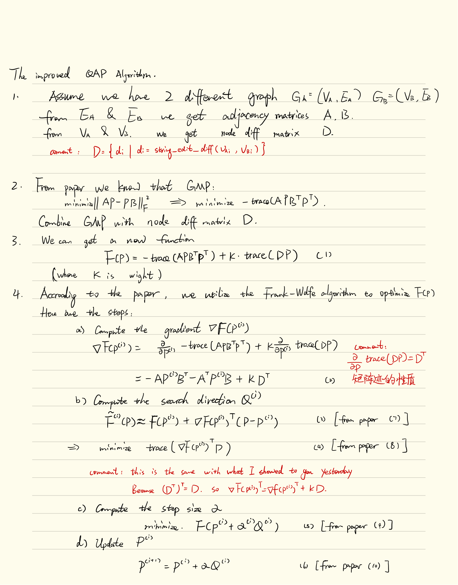

# fastQAPy
## Introduction
A python implementation for fast approximate QAP  
[paper](https://arxiv.org/abs/1112.5507)  
[FastApproximateQAP](https://github.com/jovo/FastApproximateQAP) 

## Combining with String Edit Distance

## Results

In figure 2 we can see that the algorithm with string edit distance has much better result.

(D*P should be trace(DP), which means the summary of edit distance after mapping every node of A to nodes of B )